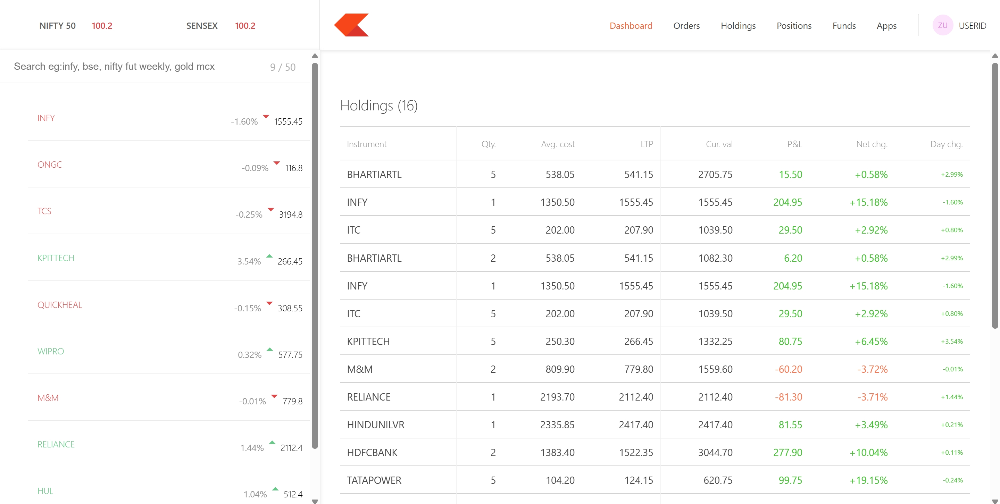
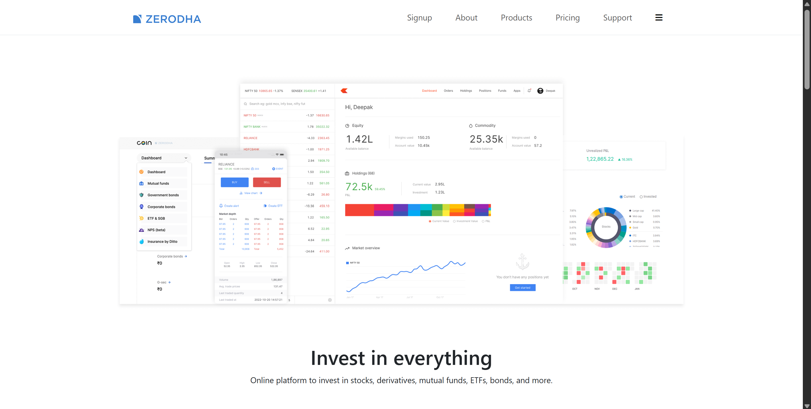

# Zerodha Clone


A full-stack clone of the Zerodha trading platform, featuring a backend API (Node.js/Express/MongoDB), a user dashboard (React), and a marketing/landing frontend (React). This project demonstrates a modern brokerage platform with portfolio management, order placement, and educational resources.

---

## Table of Contents
- [Features](#features)
- [Project Structure](#project-structure)
- [Tech Stack](#tech-stack)
- [Setup & Installation](#setup--installation)
- [Environment Variables](#environment-variables)
- [Backend API](#backend-api)
- [Frontend & Dashboard](#frontend--dashboard)
- [Screenshots](#screenshots)
- [Contributing](#contributing)
- [License](#license)

---

## Features
- **Backend API**: RESTful endpoints for holdings, positions, and orders (Node.js, Express, MongoDB).
- **User Dashboard**: Real-time portfolio, watchlist, order management, funds, and summary (React).
- **Landing Frontend**: Marketing pages, product showcase, pricing, about, and support (React).
- **Buy/Sell Modal**: Place buy/sell orders directly from the dashboard.
- **Watchlist**: Track favorite stocks with quick actions.
- **Responsive UI**: Modern, mobile-friendly design using Bootstrap and Material UI.

---

## Project Structure
```
Zerodha/
  backend/         # Node.js/Express API server
    model/         # Mongoose models
    schema/        # Mongoose schemas
    index.js       # Main server file
    package.json   # Backend dependencies
  dashboard/       # React user dashboard
    src/components # Dashboard React components
    src/data       # Sample data for watchlist, holdings, etc.
    public/        # Static assets (logo, index.html)
    package.json   # Dashboard dependencies
  frontend/        # React marketing/landing site
    src/landing    # Landing page, products, about, support, etc.
    public/media   # Images and branding assets
    package.json   # Frontend dependencies
```

---

## Tech Stack
- **Backend**: Node.js, Express, MongoDB, Mongoose, dotenv, passport (for future auth)
- **Dashboard**: React, React Router, Axios, Material UI, Chart.js
- **Frontend**: React, React Router, Bootstrap

---

## Setup & Installation

### Prerequisites
- Node.js (v18+ recommended)
- npm
- MongoDB (local or Atlas)

### 1. Clone the repository
```bash
git clone <repo-url>
cd Zerodha
```

### 2. Backend Setup
```bash
cd backend
npm install
# Create a .env file with your MongoDB URI:
echo "DATABASE_URL=mongodb://localhost:27017/zerodha" > .env
npm start
```

### 3. Dashboard Setup
```bash
cd ../dashboard
npm install
npm start
```

### 4. Frontend Setup
```bash
cd ../frontend
npm install
npm start
```

---

## Environment Variables
- **backend/.env**
  - `DATABASE_URL` — MongoDB connection string (e.g., `mongodb://localhost:27017/zerodha`)
  - `PORT` (optional) — Port for backend server (default: 8080)

---

## Backend API

### Endpoints
- `GET /allHoldings` — List all holdings
- `GET /allPositions` — List all positions
- `GET /allOrders` — List all orders
- `POST /newOrder` — Place a new order
  - Body: `{ name, qty, price, mode }`

#### Data Models
- **Holding**: `{ name, qty, avg, price, net, day }`
- **Order**: `{ name, qty, price, mode }`
- **Position**: `{ product, name, qty, avg, price, net, day, isLoss }`

---

## Frontend & Dashboard

### Dashboard Features
- **Watchlist**: Search and track stocks, quick buy/sell
- **Holdings**: View all holdings, P&L, net change
- **Positions**: Open positions, real-time updates
- **Orders**: List of all orders placed
- **Funds**: Margin, cash, and collateral overview
- **Summary**: Portfolio summary and quick stats
- **Apps**: Placeholder for integrations

### Landing Frontend
- **Home**: Hero, stats, pricing, education, open account
- **Products**: Kite, Console, Coin, Kite Connect API, Varsity
- **About**: Company info, team
- **Pricing**: Brokerage and account opening
- **Support**: Help and ticketing

---

## Screenshots

### Dashboard View

*Main dashboard showing the watchlist and holdings overview.*

### Landing Page

*Landing page showcasing the platform's features and investment options.*

---

## Contributing
1. Fork the repo and create your branch: `git checkout -b feature/your-feature`
2. Commit your changes: `git commit -am 'Add new feature'`
3. Push to the branch: `git push origin feature/your-feature`
4. Open a pull request

---

## License
This project is for educational/demo purposes only and is not affiliated with Zerodha. See [LICENSE](LICENSE) for details. 